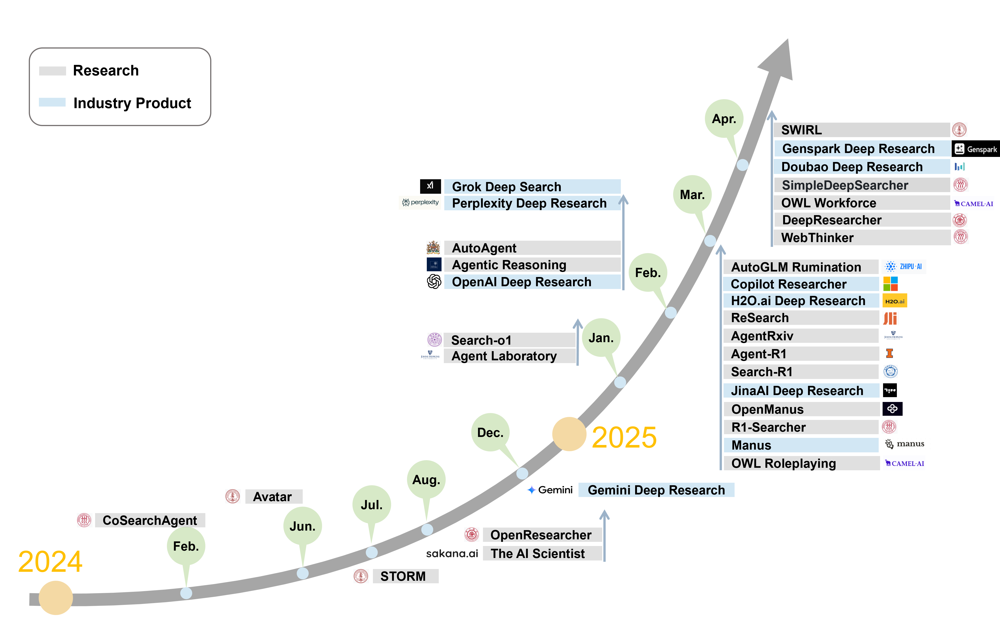

# Awesome Deep Research Agent

We maintain a curated collection of papers exploring the path towards **Deep Research (DR) Agents**, focusing on formulating core concepts and mapping the research landscape.

⌛️ **Coming soon – Version 2!** We’re continuously compiling and updating cutting‑edge insights. Feel free to suggest any related work you find valuable!

   

Build a digital assistant on your screen. Generated by <a href="https://openai.com/index/dall-e-3/">DALL-E-3</a>.

**WELCOME CONTRIBUTE!**

🔥 This project is actively maintained, and we welcome your contributions. If you have any suggestions, such as missing papers or information, please feel free to open an issue or submit a pull request.

## Our Works Towards DR Agents

✨✨✨ *LLM Agents for Deep Research: Necessity, Advances and Future Directions* <!-- 论文还未公开 -->

# Awesome Papers

<b> Table of Contents </b> 

  
1. [Search Engine Integration](#search-engine-api-vs-browser)  
2. [Tool Use](#tool-use)  
3. [Architecture & Workflow](#architecture--workflow)  
   - [Static Workflow](#static-workflow)  
   - [Dynamic Single‑Agent Workflow](#dynamic-single-agent-workflow)  
   - [Dynamic Multi‑Agent Workflow](#dynamic-multi-agent-workflow)  
4. [Tuning Methods](#tuning-methods)  
5. [Industrial Applications](#industrial-applications)  
6. [Benchmarks for DR Agents](#benchmarks-for-dr-agents)  

## Search Engine Integration 

📊 Search Engine · API vs Browser Comparison

| Legend |  ✔️ Primary focus	Secondary |  🟫 econdary/minor focus |  — Not present |
|--------|:------:|:------:|:---:|

| DR Agent | API | Browser | GAIA | HLE | QA | Base Model |
|---|:-:|:-:|:-:|:-:|---|---|
| Avatar | 🟫 | — | — | — | Stark | Claude‑3‑Opus, GPT‑4 |
| CoSearch‑Agent | ✔️ | — | — | — | — | GPT‑3.5‑turbo |
| Storm | 🟫 | — | — | — | FreshWiki | GPT‑3.5‑turbo |
| OpenResearcher | ✔️ | — | — | — | Private QA | DeepSeek‑V2‑Chat |
| The AI Scientist | ✔️ | — | — | — | MLE‑Bench | GPT‑4o, o1‑mini, o1‑preview |
| Gemini DR | ✔️ | ✔️ | — | ✔️ | GPQA | Gemini‑2.0‑Flash |
| Agent Laboratory | ✔️ | — | — | — | MLE‑Bench | GPT‑4o, o1‑preview |
| Search‑o1 | ✔️ | — | — | — | GPQA·NQ·TriviaQA | QwQ‑32B‑preview |
| Agentic Reasoning | ✔️ | — | — | — | GPQA | DeepSeek‑R1, Qwen2.5 |
| AutoAgent | — | ✔️ | ✔️ | — | — | Claude‑Sonnet‑3.5 |
| Grok DeepSearch | ✔️ | ✔️ | — | — | GPQA | Grok 3 |
| OpenAI DR | — | ✔️ | ✔️ | ✔️ | ✔️ | GPT‑o3 |
| Perplexity DR | ✔️ | 🟫 | — | ✔️ | SimoleQA | Flexible |
| AgentRxiv | ✔️ | — | — | — | GPQA·MedQA | GPT‑4o‑mini |
| Agent‑R1 | ✔️ | — | — | — | HotpotQA | Qwen2.5‑1.5B‑In |
| AutoGLM Rumination | — | ✔️ | — | — | GPQA | GLM‑Z1‑Air |
| Copilot Researcher | — | ✔️ | — | — | — | o3‑mini |
| H2O.ai DR | ✔️ | ✔️ | ✔️ | — | — | h2ogpt‑oasst1‑512‑12b |
| Manus | ✔️ | ✔️ | — | — | — | Claude 3.5, GPT‑4o |
| OpenManus | ✔️ | ✔️ | — | — | — | Claude 3.5, GPT‑4o |
| OWL | ✔️ | ✔️ | ✔️ | — | — | DeepSeek‑R1, Gemini‑2.5‑Pro, GPT‑4o |
| R1‑Searcher | 🟫 | — | — | — | 2Wiki·HotpotQA | Llama3.1‑8B‑In, Qwen2.5‑7B |
| ReSearch | 🟫 | — | — | — | 2Wiki·HotpotQA | Qwen2.5‑7B / 7B‑In |
| Search‑R1 | 🟫 | — | — | — | 2Wiki·HotpotQA·NQ·TriviaQA | Llama3.2‑3B, Qwen2.5‑3B/7B |
| DeepResearcher | — | ✔️ | — | — | HotpotQA·NQ·TriviaQA | Qwen2.5‑7B‑In |
| Genspark Super Agent | ✔️ | ✔️ | ✔️ | — | — | *Mixture of 9 LLMs* |
| WebThinker | ✔️ | — | ✔️ | ✔️ | GPQA·WebWalkerQA | QwQ‑32B |
| SWIRL | — | ✔️ | — | — | HotQA·BeerQA | Gemma 2‑27B |
| SimpleDeepSearcher | — | ✔️ | ✔️ | — | 2WikiMultiHopQA | Qwen2.5‑7B/32B‑In, DeepSeek‑D‑Qwen2.5‑32B, QwQ‑32B |

## Tool Use 

📊 Tool Use Capabilities Comparison

| Legend |  ✔️ Primary focus	Secondary |  🟫 econdary/minor focus |  — Not present |
|--------|:------:|:------:|:---:|

| DR Agent | Code Interp. | Data Analytics | Multimodal | MCP |
|---|:-:|:-:|:-:|:-:|
| CoSearchAgent | — | ✔️ | — | — |
| Storm | ✔️ | — | — | — |
| The AI Scientist | ✔️ | — | — | — |
| Agent Laboratory | ✔️ | — | — | — |
| Agentic Reasoning | ✔️ | — | — | — |
| AutoAgent | ✔️ | — | ✔️ | — |
| Genspark DR | ✔️ | ✔️ | ✔️ | ✔️ |
| Grok DeepSearch | ✔️ | ✔️ | ✔️ | 🟫 |
| OpenAI DR | ✔️ | ✔️ | ✔️ | ✔️ |
| Perplexity DR | ✔️ | ✔️ | ✔️ | 🟫 |
| Agent‑R1 | ✔️ | — | — | — |
| AutoGLM Rumination | ✔️ | — | ✔️ | 🟫 |
| Copilot Researcher | ✔️ | ✔️ | 🟫 | 🟫 |
| Manus | ✔️ | ✔️ | ✔️ | 🟫 |
| OpenManus | ✔️ | ✔️ | — | ✔️ |
| OWL | ✔️ | ✔️ | ✔️ | ✔️ |
| H2O.ai DR | ✔️ | ✔️ | ✔️ | 🟫 |
| Genspark Super Agent | ✔️ | ✔️ | ✔️ | ✔️ |
| WebThinker | ✔️ | — | — | — |

## Architecture & Workflow 

  

### Static Workflow 
+ **[AvaTaR: Optimizing LLM Agents for Tool Usage via Contrastive Reasoning](https://arxiv.org/abs/2406.11200)**  
+ **[Agent Laboratory: Using LLM Agents as Research Assistants](https://arxiv.org/abs/2501.04227)**  
+ **[CoSearchAgent: A Lightweight Collaborative Search Agent with Large Language Models](https://arxiv.org/abs/2402.06360)**  
+ **[AgentRxiv: Towards Collaborative Autonomous Research](https://agentrxiv.github.io/)**  

### Dynamic Single‑Agent Workflow 
+ **[OpenResearcher: Unleashing AI for Accelerated Scientific Research](https://arxiv.org/abs/2408.06941)**  [
+ **[Search-o1: Agentic Search-Enhanced Large Reasoning Models](https://arxiv.org/abs/2501.05366)**  
+ **[Agentic Reasoning: Reasoning LLMs with Tools for the Deep Research](https://arxiv.org/abs/2502.04644)**  
+ **[Agent-R1: Training Powerful LLM Agents with End-to-End Reinforcement Learning](https://github.com/0russwest0/Agent-R1)**  
+ **[R1-Searcher: Incentivizing the Search Capability in LLMs via Reinforcement Learning](https://arxiv.org/abs/2503.05592)**   
+ **[Search-R1: Training LLMs to Reason and Leverage Search Engines with Reinforcement Learning](https://arxiv.org/abs/2503.09516)**   
+ **[DeepResearcher: Scaling Deep Research via Reinforcement Learning in Real-world Environments](https://arxiv.org/abs/2504.03160)**  
+ **[WebThinker: Empowering Large Reasoning Models with Deep Research Capability](https://arxiv.org/abs/2504.21776)**  
+ **[Open AI Deep Research](https://openai.com/index/introducing-deep-research/)**
+ **[Google Gemini Deep Research](https://gemini.google/overview/deep-research/)**
+ **[Grok Deep Search](https://x.ai/news/grok-3)**
+ **[Perplexity Deep Research](https://www.perplexity.ai/hub/blog/introducing-perplexity-deep-research)**
+ **[ReSearch: Learning to Reason with Search for LLMs via Reinforcement Learning](https://github.com/Agent-RL/ReSearch)**  
+ **[Synthetic Data Generation & Multi-Step RL for Reasoning & Tool Use](https://arxiv.org/abs/2504.04736)**
+ **[H2O.ai Deep Research](https://h2o.ai/)**
+ **[SimpleDeepSearcher: Deep Information Seeking via Web-Powered Reasoning Trajectory Synthesis](https://github.com/RUCAIBox/SimpleDeepSearcher)** 

### Dynamic Multi‑Agent Workflow 
+ **[Assisting in Writing Wikipedia-like Articles From Scratch with Large Language Models](https://arxiv.org/abs/2402.14207)** 
+ **[AutoAgent: A Fully-Automated and Zero-Code Framework for LLM Agents](https://arxiv.org/pdf/2502.05957)**  
+ **[OpenManus](https://github.com/mannaandpoem/OpenManus)**  
+ **[Manus](https://manus.im/)**

## Tuning Methods 

📊 Tuning Methods Comparison

| Legend | ✔️ Implemented | 🟫 Partial | — Not present |
|--------|:--------------:|:-----------------------:|:--------:|

| DR Agent | SFT | RL | Base Model | Data | Reward Design |
|---|:-:|:-:|---|---|---|
| Gemini DR | 🟫 | 🟫 | Gemini‑2.0‑Flash | — | 🟫 |
| Grok DeepSearch | — | 🟫 | Grok 3 | — | 🟫 |
| OpenAI DR | — | 🟫 | GPT‑o3 | — | 🟫 |
| Agent‑R1 | — | PPO · Reinforce++ · GRPO | Qwen2.5‑1.5B‑In | HotpotQA | Rule‑Outcome |
| AutoGLM Rumination | 🟫 | 🟫 | GLM‑Z1‑Air | — | 🟫 |
| H2O.ai DR | ✔️ | 🟫 | h2ogpt‑oasst1‑512‑12b | — | 🟫 |
| Copilot Researcher | 🟫 | 🟫 | o3‑mini | — | — |
| ReSearch | — | GRPO | Qwen2.5‑7B‑In / 32B‑In | 2WikiMultiHopQA | Rule‑Outcome |
| R1‑Searcher | ✔️ | Reinforce++ · GRPO | Qwen2.5‑7B‑In / Llama3.1‑8B‑In | 2WikiMultiHopQA · HotpotQA | Rule‑Outcome |
| Search‑R1 | ✔️ | PPO · GRPO | Qwen2.5‑3B/7B / Llama3.2‑3B‑In | NQ · HotpotQA | Rule‑Outcome |
| DeepResearcher | — | GRPO | Qwen2.5‑7B‑In | NQ · HotpotQA | Rule‑Outcome |
| Genspark Super Agent | — | — | Mixture of Agents | — | — |
| WebThinker | ✔️ | — | QwQ‑32B | Expert Dataset | — |
| SWIRL | — | Offline‑RL | Gemma 2‑27B | HotpotQA | — |
| SimpleDeepSearcher | ✔️ | PPO | Qwen2.5‑7B/32B‑In · DeepSeek‑Distilled‑Qwen‑32B · QwQ‑32B | NQ · HotpotQA · 2WikiMultiHopQA · Musique · SimpleQA · MultiHop‑RAG | Process‑based reward |

## Benchmarks for DR Agents 

📊 QA Benchmarks (Hotpot / 2Wiki / NQ / TQ / GPQA)

| DR Agent | Base Model | Hotpot | 2Wiki | NQ | TQ | GPQA |
|---|---|---|---|---|---|---|
| Search‑o1 | QwQ‑32B‑preview | 57.3 | **71.4** | <u>49.7</u> | <u>74.1</u> | 57.9 |
| Agentic Reasoning | DeepSeek‑R1, Qwen2.5 | — | — | — | — | 67.0 |
| Grok DeepSearch | Grok 3 | — | — | — | — | **84.6** |
| AgentRxiv | GPT‑4o‑mini | — | — | — | — | 41.0 |
| R1‑Searcher | Qwen2.5‑7B‑Base | 71.9 | 63.8 | — | — | — |
| ReSearch | Qwen2.5‑7B‑Base | 30.0 | 29.7 | — | — | — |
| ReSearch | Qwen2.5‑7B‑In | 63.6 | 54.2 | — | — | — |
| ReSearch | Qwen2.5‑32B‑Base | 64.3 | 45.6 | — | — | — |
| ReSearch | Qwen2.5‑32B‑In | 67.7 | 50.0 | — | — | — |
| Search‑R1 | Llama3.2‑3B‑Base | 30.0 | 29.7 | 43.1 | 61.2 | — |
| Search‑R1 | Llama3.2‑3B‑In | 31.4 | 23.3 | 35.7 | 57.8 | — |
| Search‑R1 | Qwen2.5‑7B‑Base | 28.3 | 27.3 | 39.6 | 58.2 | — |
| Search‑R1 | Qwen2.5‑7B‑In | 34.5 | 36.9 | 40.9 | 55.2 | — |
| DeepResearcher | Qwen2.5‑7B‑In | 64.3 | <u>66.6</u> | **61.9** | **85.0** | — |
| Genspark Super Agent | Mixture of Agents | — | — | — | — | — |
| WebThinker | QwQ‑32B | — | — | — | — | <u>68.7</u> |
| SimpleDeepSearch | Qwen2.5‑7B‑In | — | 68.1 | — | — | — |
| SimpleDeepSearch | Qwen2.5‑32B‑In | **70.5** | — | — | — | — |
| SimpleDeepSearch | DeepSeek‑R1‑Distill‑Qwen‑32B | 68.1 | — | — | — | — |
| SimpleDeepSearch | QwQ‑32B | **73.5** | — | — | — | — |
| SWIRL | Gemma 2‑27B | <u>72.0</u> | — | — | — | — |

📊 GAIA (Val) & HLE Benchmarks

| DR Agent | Base Model | GAIA L‑1 | L‑2 | L‑3 | Ave. | HLE |
|---|---|:-:|:-:|:-:|:-:|:-:|
| AutoAgent | Claude‑Sonnet‑3.5 | 71.7 | 53.5 | 26.9 | 55.2 | — |
| OpenAI DR | GPT‑o3‑custom | 78.7 | **73.2** | <u>58.0</u> | 67.4 | **26.6** |
| Perplexity DR | Flexible | — | — | — | — | <u>21.1</u> |
| Manus | Claude 3.5 · GPT‑4o | <u>86.5</u> | 70.1 | 57.7 | <u>71.4</u> | — |
| OWL | Claude‑3.7‑Sonnet | 84.9 | 68.6 | 42.3 | 69.7 | — |
| H2O.ai DR | h2ogpt‑oasst1‑12B | 67.9 | 67.4 | 42.3 | 63.6 | — |
| Genspark Super Agent | Claude 3 Opus | **87.8** | <u>72.7</u> | **58.8** | **73.1** | — |
| WebThinker | QwQ‑32B | 53.8 | 44.2 | 16.7 | 44.7 | 13.0 |
| SimpleDeepSearch | QwQ‑32B | 50.5 | 45.8 | 13.8 | 43.9 | — |

<!-- ## Relevant Survey
+ [A Survey of Generative Search and Recommendation in the Era of Large Language Models](https://arxiv.org/abs/2404.16924) (Apr.2024)
  
+ [When Search Engine Services meet Large Language Models: Visions and Challenges](https://arxiv.org/abs/2407.00128) (June.2024)

+ [Large Language Models for Information Retrieval: A Survey](https://arxiv.org/abs/2308.07107) (Sep.2024)

## Benchmark
+ [SWE-bench: Can Language Models Resolve Real-World GitHub Issues?](https://arxiv.org/abs/2310.06770) (Oct.2023)    
  

  
+ [GAIA: a benchmark for General AI Assistants](https://arxiv.org/abs/2311.12983) (Nov.2023)

+ [Learning to Ask: When LLM Agents Meet Unclear Instruction](https://arxiv.org/abs/2409.00557v3) (Aug.2024)
  
+ **[MLGym: A New Framework and Benchmark for Advancing AI Research Agents](https://arxiv.org/abs/2502.14499) (Feb. 2025)**  
   [GitHub Repo](https://github.com/facebookresearch/MLGym)

+ [Retrieval Models Aren't Tool-Savvy: Benchmarking Tool Retrieval for Large Language Models](https://arxiv.org/abs/2503.01763) (Mar.2025)

## Close Source Research Agent
+ **[Google Gemini Deep Research](https://gemini.google/overview/deep-research/) (Dec.2024)

+ **[Open AI Deep Research](https://openai.com/index/introducing-deep-research/) (Feb.2025)

+ **[Perplexity Deep Research](https://www.perplexity.ai/hub/blog/introducing-perplexity-deep-research) (Feb.2025)

+ **[Grok Deep Search](https://x.ai/news/grok-3) (March. 2025)

## Deep Research Agent (final):

## Deep Research Agent
+ **[Agentic Reasoning: Reasoning LLMs with Tools for the Deep Research](https://arxiv.org/abs/2502.04644) (Feb.2025)**  

+ **[AgentRxiv: Towards Collaborative Autonomous Research](https://agentrxiv.github.io/) (Mar.2025)**  

+ **[Agent-R1: Training Powerful LLM Agents with End-to-End Reinforcement Learning](https://github.com/0russwest0/Agent-R1) (Mar.2025)**  

## Retrieval/Search Augmented Agent Framework
+ **[Assisting in Writing Wikipedia-like Articles From Scratch with Large Language Models](https://arxiv.org/abs/2402.14207) (Jul.2024)**   

+ **[OPEN-RAG: Enhanced Retrieval-Augmented Reasoning with Open-Source Large Language Models](https://arxiv.org/abs/2410.01782) (Oct.2024)**   
  
+ [Chain-of-Retrieval Augmented Generation](https://arxiv.org/abs/2501.14342) (Jan.2025)  

+ **[Search-o1: Agentic Search-Enhanced Large Reasoning Models](https://arxiv.org/abs/2501.05366) (Jan.2025)**   

+ [FlashRAG: A Modular Toolkit for Efficient Retrieval-Augmented Generation Research](https://arxiv.org/abs/2405.13576) (Feb.2025)**  

+ [DeepRAG: Thinking to Retrieval Step by Step for Large Language Models](https://arxiv.org/abs/2502.01142) (Feb.2025)**  

+ [Toward Agentic AI: Generative Information Retrieval Inspired Intelligent Communications and Networking](https://arxiv.org/abs/2502.16866) (Feb.2025)

## Toolcall Agent Framework
+ [Agent S: An Open Agentic Framework that Uses Computers Like a Human](https://arxiv.org/abs/2410.08164) (Oct.2024)**  

+ [Open AI Operator](https://openai.com/index/introducing-operator/) (Jan.2025)

+ [AutoAgent: A Fully-Automated and Zero-Code Framework for LLM Agents](https://arxiv.org/pdf/2502.05957) (Feb. 2025)**  

+ [Agent S2: An Open, Modular, and Scalable Framework for Computer Use Agents](https://www.simular.ai/agent-s2) (Mar.2025)

+ **[OWL: Optimized Workforce Learning for General Multi-Agent Assistance in Real-World Task Automation](https://github.com/camel-ai/owl/tree/main?tab=readme-ov-file) (Mar.2025)**   

+ **[OpenManus](https://github.com/mannaandpoem/OpenManus) (Mar. 2025)**   

+ [START: Self-taught Reasoner with Tools](https://arxiv.org/abs/2503.04625) (Mar.2025)

## Reinforcement Learning
+ [DeepRetrieval: Powerful Query Generation for Information Retrieval with Reinforcement Learning](https://arxiv.org/abs/2503.00223) (Feb.2025)

+ [ReSearch: Learning to Reason with Search for LLMs via Reinforcement Learning](https://github.com/Agent-RL/ReSearch) (Mar.2025)**   

+ [R1-Searcher: Incentivizing the Search Capability in LLMs via Reinforcement Learning](https://arxiv.org/abs/2503.05592) (Mar.2025)**    
  
+ [Search-R1: Training LLMs to Reason and Leverage Search Engines with Reinforcement Learning](https://arxiv.org/abs/2503.09516) (Mar.2025)**   

+ [Agent-R1: Training Powerful LLM Agents with End-to-End Reinforcement Learning](https://github.com/0russwest0/Agent-R1) (Mar.2025)**   -- >

